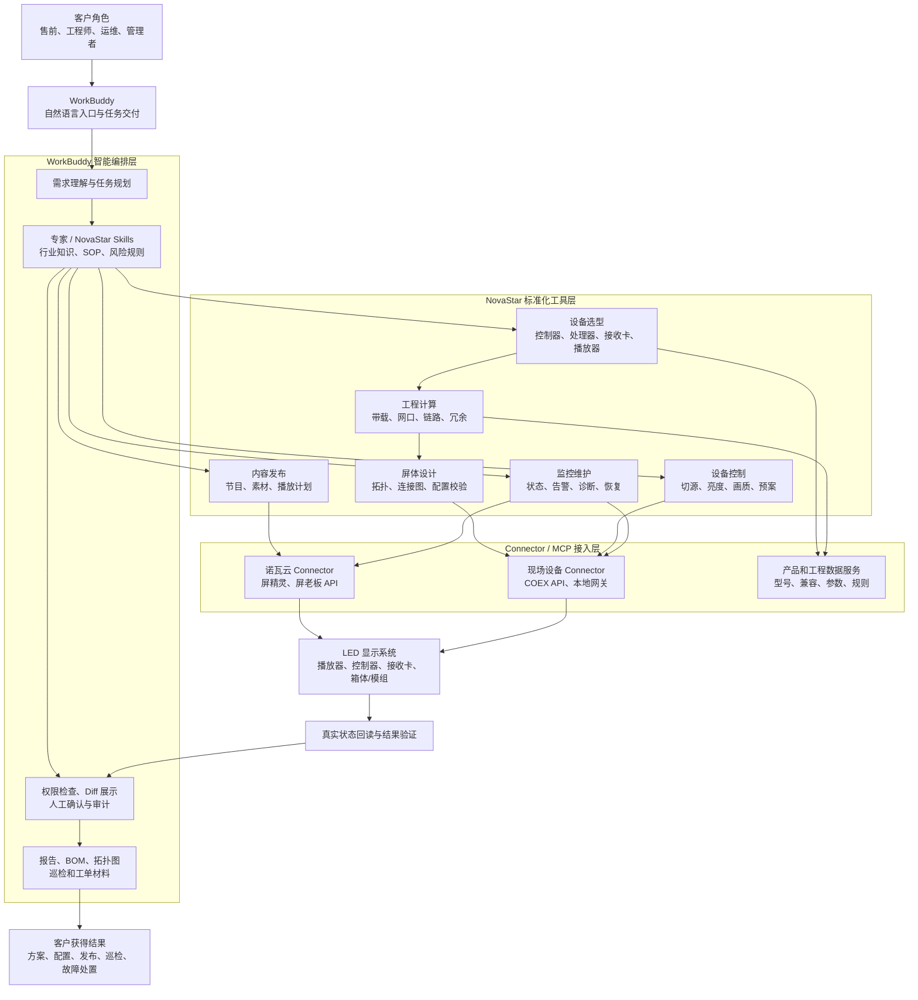

# NovaStar Skill / MCP 能力构想（审核修订版）

## 一、核心判断

NovaStar 的核心不是制造或销售 LED 屏体，而是提供 LED 显示系统的控制、视频处理、屏体配置、画质校正、内容发布和监控运维能力。

NovaStar 通常不只在客户采购 LED 屏体之后介入。控制器、接收卡、播放器和控制软件的选择会影响屏体带载、走线、拓扑、备份和系统架构，因此其能力往往从方案设计阶段贯穿到长期运营：

```text
客户需求
→ 屏体及箱体方案
→ 控制系统选型
→ 带载与拓扑设计
→ 采购安装
→ 配屏调试和画质校正
→ 内容播放
→ 监控运维
```

可以将其理解为：

- 屏厂负责灯珠、模组、箱体等物理显示载体；
- NovaStar 负责让屏体正确显示、稳定运行并能够被集中控制和管理；
- AI Agent、Skill 和 MCP 则让用户可以通过自然语言完成方案设计、设备操作和运维工作。

NovaStar 已具备诺瓦云开放平台和 COEX 设备 API，因此在信息发布、监控运维和部分设备控制方面拥有较好的 Agent 化基础。但不同产品线的接口开放程度并不一致：云端发布和监控接口相对成熟，COEX/VMP 已具备较丰富的本地设备 API，而 NovaLCT、SmartLCT 及部分传统设备的完整配屏自动化能力仍需逐项确认。

与 `easyeda-agent` 类比时，应注意：`easyeda-agent` 当前通过 Connector 调用 EasyEDA 官方 `eda.*` API，并不是对编辑器 API 的逆向封装。两者真正可以借鉴的是“结构化资产、强类型动作、写前校验、写后回读和可审计交付”的方法。

### 1.1 参考案例：easyeda-agent

项目地址：<https://github.com/zhoushoujianwork/easyeda-agent>

`easyeda-agent` 是面向 EasyEDA Pro（嘉立创 EDA 专业版）的 AI 自动化层。用户可以用自然语言描述电路需求或需要修复的问题，Agent 读取真实工程数据，并通过 EasyEDA 官方 `eda.*` API 完成原理图、PCB 和器件库相关操作。

它覆盖的典型能力包括：

- 根据数据手册和尺寸图创建 Symbol、Footprint、Device 及可选 3D Model；
- 从自然语言需求完成器件选型、原理图设计、PCB 布局、布线、铺铜和丝印整理；
- 使用准确型号或 LCSC C 号标准化原理图器件；
- 检查悬空、短路、网络、位号、封装、板框和几何问题；
- 执行原理图检查、PCB DRC/DFM，并生成 BOM、网表、制造文件和审计记录；
- 在写入前检查工程、页面、器件身份和源数据，写入后回读引脚、网络、几何和对象绑定。

其主要结构可以概括为：

```text
AI Agent / Skill
        ↓
easyeda CLI + 本地 daemon
        ↓ typed actions / audit / artifacts
EDA Agent Connector
        ↓ 官方 eda.* API
EasyEDA Pro 工程
```

NovaStar 方案借鉴的是这种产品化方法，而不是简单照搬 EDA 功能：

| easyeda-agent | NovaStar + WorkBuddy 对应能力 |
|---|---|
| 元器件、封装和 LCSC 型号库 | 控制器、处理器、播放器、接收卡和兼容性库 |
| PCB 材料、叠层和设计规则 | 屏体、箱体、带载、拓扑和冗余规则 |
| 画原理图和 PCB 的 typed actions | 配屏、设备控制、节目发布和监控运维动作 |
| ERC、DRC、DFM | 带载、拓扑、兼容性、权限和运行状态检查 |
| 写入后回读工程对象 | 写入后回读设备、屏幕、箱体和播放状态 |
| CLI、Skill、Connector 三层接入 | WorkBuddy、NovaStar Skill、云端/现场 MCP Connector |

两者的共同目标，是把专业软件和行业知识转化成 AI 可以安全调用、结果可以验证的标准工程能力。差别在于：`easyeda-agent` 面向电子设计和 PCB 交付；NovaStar 方案面向 LED 显示系统的设计、配置、控制、发布和运维。

## 二、对应“元器件库”：设备与兼容性库

可以建立结构化的 NovaStar 产品与兼容性数据库，包括：

- 控制器、视频处理器、媒体播放器、发送设备、接收卡和配件；
- 输入输出接口、最大带载、分辨率、帧率、位深和视频处理能力；
- 控制器、接收卡、驱动 IC、固件和软件版本之间的兼容关系；
- 产品生命周期、适用场景、替代型号和限制条件；
- 固装、租赁、演播室、数字标牌、超长屏、异形屏和低延迟等标准方案。

在此基础上，可以提供强类型选型工具：输入屏幕尺寸、分辨率、点间距、箱体规格、信号源、刷新率、场景、冗余要求和预算，输出推荐的控制设备组合、数量、兼容性依据和风险项。

这与 EasyEDA 根据型号或 LCSC C 号匹配器件类似，但 NovaStar 对应的是显示控制设备和系统方案的匹配，而不是 LED 灯珠或屏体本身的选型。

## 三、对应“材料库”：屏体工程参数库

屏体工程参数库可以包括：

- 模组和箱体尺寸、点间距、像素密度及箱体分辨率；
- 扫描方式、刷新率、灰度、驱动 IC 和灯珠相关参数；
- 箱体功耗、电源、配电、散热和环境监控参数；
- 接收卡带载、发送端网口带载、光纤链路和备份规则；
- 箱体排列、走线、分组、旋转、弧面和异形拓扑；
- 配置文件、工程模板、预案、校正系数和历史版本。

需要注意，屏体和箱体数据并不全部属于 NovaStar：控制设备及其能力数据主要由 NovaStar 提供，模组、箱体、配电和部分光电参数通常来自屏厂或项目客户。因此，这一数据层需要由 NovaStar、屏厂和客户项目数据共同组成，并记录来源、版本和适用范围。

带载计算不能只依据总像素，需要同时考虑：

- 控制设备和接收卡的能力边界；
- 实际刷新率、灰度和扫描方式；
- 单网口带载和实际走线拓扑；
- 输入分辨率、帧率、位深及处理链路；
- 主备关系、链路余量和产品型号限制。

## 四、对应“画板动作”：屏体工程与运营动作

NovaStar 场景中的“画板动作”不是定制 LED 硬件，而是对不同 LED 显示项目进行方案设计、配置、控制和运营。

### 4.1 本地设备与 COEX/VMP 链路

COEX 已提供公开 HTTP API，可用于读取或控制部分设备和屏幕能力，例如：

- 读取设备、输入源、屏幕、箱体、幕布和图层信息；
- 设置亮度、Gamma、色温、色域和部分画质参数；
- 黑屏、冻结、恢复正常显示；
- 切换输入源、设置 EDID 和图层信号源；
- 获取并应用预案；
- 获取实时监控信息；
- 执行部分箱体 Mapping、多模式和拓扑相关操作。

因此，不能笼统地把本地自动化描述为“只能通过 SmartLCT 离线设计”。更准确的划分是：

- COEX/VMP：具备较丰富的公开设备控制 API，适合优先封装；
- NovaLCT/SmartLCT：传统产品和配屏工作流仍需确认正式 SDK、扩展接口或工程文件能力；
- CabinetTool：适用于部分异形箱体、像素映射和特殊屏体配置场景，其自动化接口需要单独确认。

仍需通过 PoC 验证以下边界：

- 能否通过 API 创建、修改和删除完整屏体工程；
- 能否完整写入箱体拓扑、端口走线和接收卡参数；
- 能否可靠导入、导出和恢复全部工程配置；
- 不同设备型号和固件版本的 API 覆盖差异；
- VMP 与外部 API 访问同一设备时的占用和互斥处理。

### 4.2 诺瓦云开放平台链路

建议统一使用官方名称：**诺瓦云开放平台**，其中主要包括：

- **屏精灵信息发布 API**：播放器列表、播放器状态、运行控制、节目发布、素材和播放日志等；
- **屏老板监控 API**：终端设备、显示屏基本信息和运行状态监控。

信息发布、监控和远程控制能力取决于设备系列、绑定关系、传感器及平台权限，不能默认所有设备都支持所有指标。正式接入还需要处理：

- 设备绑定和企业认证；
- AK/AS 鉴权、凭证保护和轮换；
- 国内外区域节点及数据隔离；
- 租户、账号、角色和设备权限；
- 素材上传、异步发布、状态轮询及失败重试；
- 幂等、限流、日志和告警处理。

因此，云端 MCP 的接口基础较好、PoC 成本相对较低，但生产级实现并不只是简单转发 API。

### 4.3 校正与现场维护链路

亮色度校正、亮暗线修正、接缝调节和换卡恢复可以成为高价值能力，但不能描述为普通的软件写入动作。这些流程可能依赖：

- 相机、色度计和现场测试环境；
- 屏体、箱体或模组校正数据库；
- 接收卡、模组 Flash 和校正系数管理；
- 测试图、拍摄、计算、下发和实际画面复核；
- 工程师对异常区域和风险的人工判断。

适合将其设计成“AI 引导 + 设备闭环 + 人工确认”的工作流，而不是让模型根据一张现场照片直接修改校正参数。

## 五、建议的 Skill / MCP 形态

| 能力 | 类型 | 主要依赖 |
|---|---|---|
| `novastar-device-select` 设备选型与 BOM | 只读查询、规则计算 | 产品库、兼容矩阵 |
| `novastar-load-calc` 带载、接收卡和网口计算 | 确定性计算工具 | 屏体参数、设备能力、带载规则 |
| `novastar-screen-design` 拓扑和连接图设计 | 方案生成、校验、有限写入 | 项目参数、COEX/VMP 或其他正式接口 |
| `novastar-device-control` 本地设备控制 | 读取、控制、回读 | COEX API、现场网关 |
| `novastar-publish` 节目编排与发布 | 云端动作 | 屏精灵 API |
| `novastar-monitor` 状态监控与告警 | 只读监控、远程处置 | 屏老板 API、设备监控能力 |
| `novastar-maintain` 故障定位与维护 | 诊断、SOP、受控动作 | 监控数据、设备日志、现场流程 |
| `novastar-calibration` 画质校正 | 人机协同、设备闭环 | 校正设备、系数库、正式接口 |

Skill 负责行业知识、操作顺序、参数解释、风险规则和异常恢复；MCP 负责读取真实设备数据并执行结构化动作。复杂能力不宜拆成多个彼此独立的 MCP Server，优先按认证域、部署位置和权限边界划分，例如“诺瓦云 Connector”和“现场设备 Connector”。

## 六、WorkBuddy 在方案中的位置

WorkBuddy 位于客户与 NovaStar 能力之间，是整个方案的**用户入口、智能编排层和交付载体**。它既不替代 NovaStar 的设备、云平台和工程规则，也不直接充当底层设备协议，而是把分散的产品知识、计算工具、云端 API 和现场设备动作组织成客户能够直接使用的完整任务。

```text
客户 / 售前 / 工程师 / 运维人员
                ↓
           WorkBuddy
    自然语言入口、任务规划、权限确认、结果交付
        ↓ Skill                 ↓ Connector
    NovaStar 行业知识       云端 MCP / 现场 MCP
        ↓                        ↓
    规则与操作流程      诺瓦云 / COEX / 本地设备网关
                ↓
          LED 显示系统
```

WorkBuddy 官方开放平台支持 Buddy 应用、专家、Skill、Connector 和硬件生态；对于已有网络 API 的系统，官方推荐采用“MCP + Skill”方式接入。NovaStar 的云端 API 和现场设备 API 与这一扩展模型匹配。

### 6.1 WorkBuddy 在各环节解决的客户问题

| 客户环节 | 客户问题 | WorkBuddy 的作用 | 交付结果 |
|---|---|---|---|
| 售前与方案设计 | 产品资料分散，选型和带载依赖资深工程师 | 理解自然语言需求，调用产品库、兼容规则和计算工具 | 推荐方案、BOM、带载结果、风险说明 |
| 项目深化设计 | 箱体、网口、链路和备份需要反复计算，方案修改成本高 | 编排选型、计算、拓扑生成和规则校验 | 连接图、配置草案、变更 Diff、实施清单 |
| 现场安装调试 | 工程师需要在多个软件间切换，操作步骤复杂且容易遗漏 | 通过现场 Connector 读取真实设备状态，按 SOP 执行受控操作 | 配置备份、设备设置、回读验证、调试报告 |
| 内容发布运营 | 节目制作、发布、播放检查和日志查询分散 | 调用屏精灵 API 完成节目发布和状态跟踪 | 发布任务、播放结果、失败重试记录 |
| 日常监控运维 | 多地点设备状态难以集中理解，告警缺少上下文 | 汇总屏老板及设备监控数据，结合知识库分析异常 | 巡检报告、告警解释、处置建议或受控修复 |
| 故障支持 | 客户描述不专业，日志、配置和手册需要人工交叉核对 | 将用户描述、设备状态、日志和历史变更组合诊断 | 原因排序、验证步骤、备件建议、服务工单材料 |
| 管理与审计 | 无法回答谁在何时修改了哪块屏、结果如何 | 统一承载审批、操作记录、回读结果和交付文档 | 可追溯操作链和项目资产沉淀 |

### 6.2 WorkBuddy 的差异化价值

这里的“唯一性”不应表述为市场上只有 WorkBuddy 能做 MCP 或 Agent，而应表述为它在本方案中的独特、难替代价值：

1. **从 API 能力变成客户可用的完整任务**  
   NovaStar 提供设备和接口，MCP 提供原子动作；WorkBuddy 负责理解客户目标、拆解步骤、选择工具、处理异常并交付最终结果。客户不需要学习 API、命令或多个控制软件。

2. **同时连接办公工作流和真实设备**  
   同一个任务可以读取需求文档和项目表格，生成方案与报告，再通过 Connector 操作诺瓦云或现场设备，最后把真实回读结果写回交付物。这形成“文档—决策—设备—验证”的闭环。

3. **把 NovaStar 工程经验产品化和规模化分发**  
   NovaStar 的选型规则、调试 SOP、故障经验和安全边界可以沉淀为 Skill、专家或 Buddy 应用，使合作伙伴和客户复用同一套经过验证的方法，而不是依赖少数工程师口头传授。

4. **统一编排云端与现场两类能力**  
   诺瓦云适合发布和远程监控，现场网关适合访问局域网内的 COEX/VMP 设备。WorkBuddy 可以从用户视角把两套系统组织成一个任务，而底层仍保持凭证、网络和权限隔离。

5. **保留人在回路和可审计交付**  
   对黑屏、拓扑覆盖、校正系数和固件升级等高风险操作，WorkBuddy 可以在执行前展示差异并请求确认，将备份、执行、回读和报告串成标准流程。

因此，WorkBuddy 的核心价值不是“多一个聊天界面”，而是成为 NovaStar 行业能力的**自然语言操作系统和规模化交付平台**：上接客户需求与办公场景，下接 NovaStar 的产品数据、云服务和现场设备。

## 七、安全执行闭环

任何会影响真实屏幕的动作，都应采用以下流程：

```text
用户需求
→ AI 生成方案
→ 检查设备、固件、API 和权限覆盖
→ 读取并备份当前状态
→ 执行规则校验
→ 展示变更 Diff
→ 高风险动作人工确认
→ 写入配置
→ 回读并验证结果
→ 失败时停止或回滚
→ 生成审计报告
```

应特别保护以下动作：

- 黑屏、冻结和节目替换；
- 覆盖屏体拓扑或接收卡参数；
- 写入或清除校正系数；
- 固件升级和批量设备操作；
- 修改主备关系、EDID 和关键视频参数。

## 八、推荐实施路径

### 第一阶段：API 已明确的能力

- 产品和兼容性查询；
- 带载及网口计算；
- 屏精灵节目发布；
- 屏老板状态监控；
- COEX 设备发现、状态读取和低风险控制；
- 配置备份、操作日志和写后回读。

### 第二阶段：屏体工程自动化

- 箱体拓扑和走线方案生成；
- 配置规则检查；
- 工程配置导入导出；
- 配置 Diff、漂移检测和恢复；
- 不同型号和固件的兼容适配。

### 第三阶段：现场闭环与高级能力

- 相机或色度计辅助校正；
- 亮暗线和接缝修正；
- 异形屏配置；
- 多屏、多设备和跨项目协同；
- 固件治理和预测性维护。

## 九、包含 WorkBuddy 的总体架构图



## 十、结论

NovaStar Skill / MCP 的目标不是让 AI“定制不同的 LED”，而是利用 NovaStar 的控制设备、软件和云平台能力，让 AI 更快地完成不同 LED 显示项目的设计、配置、调试、内容发布和长期运维。

最现实的路径是以 WorkBuddy 作为统一客户入口和智能编排层，先通过诺瓦云和 COEX API 落地“选型、计算、发布、监控与安全控制”，再根据各产品线的正式接口覆盖情况逐步推进自动配屏。真正形成差异化的，不是简单调用 API，而是：

> WorkBuddy 任务编排 + NovaStar 工程规则 + 产品数据 + 真实设备状态 + 写前校验 + 写后回读 + 可回滚审计。

在这套组合中，NovaStar 提供专业能力和设备事实，MCP/Connector 提供可执行工具，WorkBuddy 负责把这些能力转化为客户能够直接使用、可以规模化复制并且结果可验收的行业解决方案。

## 参考资料

- [easyeda-agent：通过官方 `eda.*` API 操作 EasyEDA Pro](https://github.com/zhoushoujianwork/easyeda-agent)
- [NovaStar COEX API](https://api.coex.novastar.tech/)
- [COEX 获取屏幕信息 API](https://api.coex.novastar.tech/api-363923633)
- [诺瓦云开放平台 API 接入指南](https://developer-cn.vnnox.com/)
- [NovaStar 官方网站](https://www.novastar.tech/)
- [WorkBuddy 开放平台](https://open.workbuddy.cn/)
- [WorkBuddy Connector 文档](https://open.workbuddy.cn/docs/connector)
